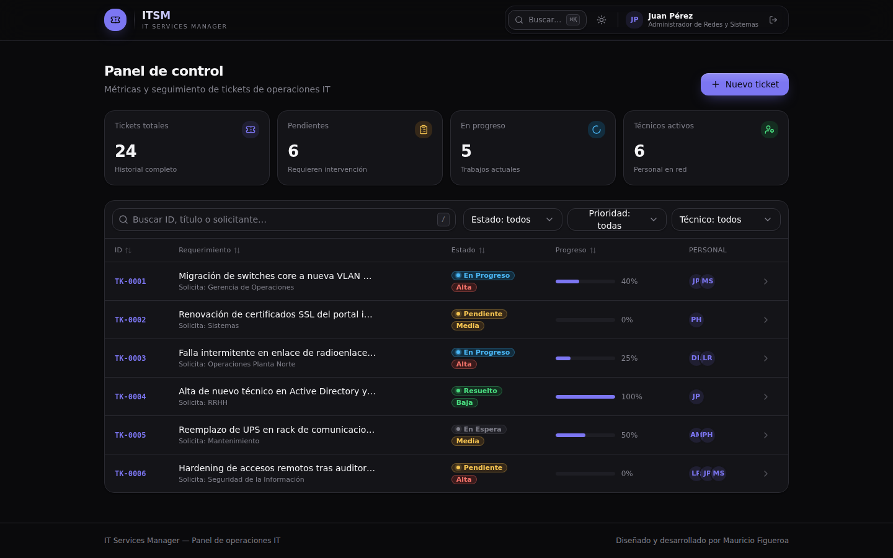
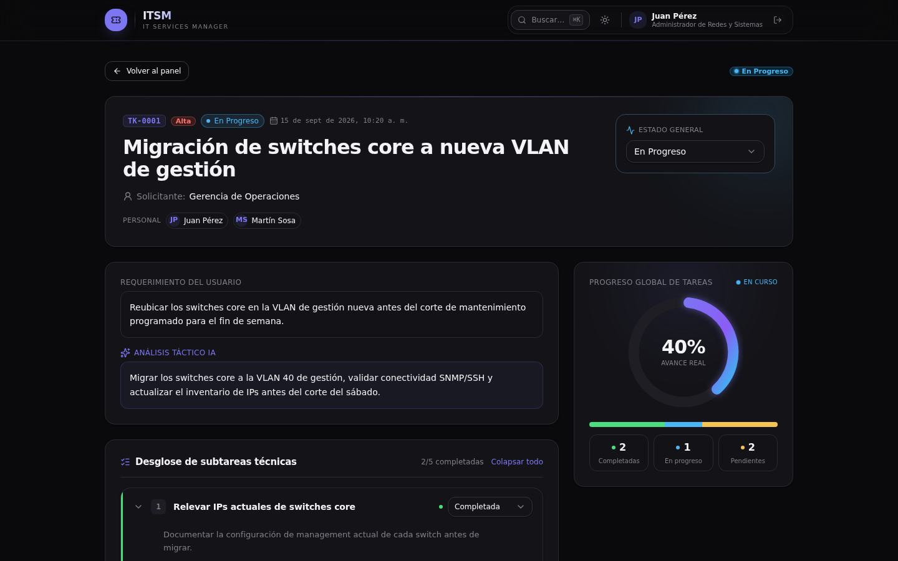
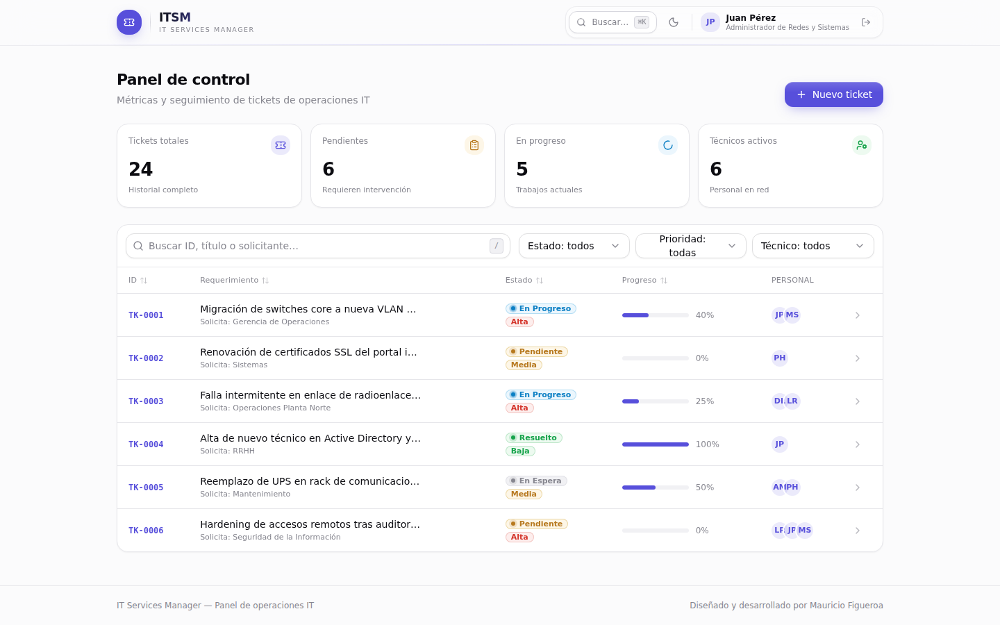
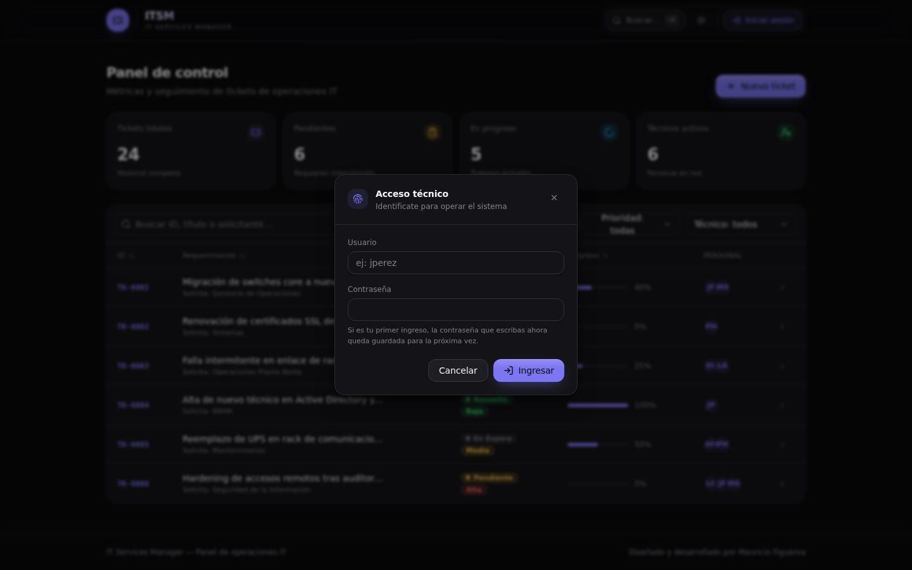

# IT Services Manager

Sistema web para gestión de tickets de infraestructura IT, con desglose automático de subtareas mediante IA (Groq), trazabilidad de tiempos por técnico, login por técnico y conectividad nativa a Power BI.

> Proyecto personal de portfolio. Es una versión saneada (sin datos ni nombres reales) del sistema que desarrollé para el equipo de sistemas de mi trabajo, donde está en producción como servicio de Windows.

## Funcionalidades

- Alta de tickets con desglose automático de subtareas vía IA (Groq, modelo `openai/gpt-oss-20b`)
- Login por técnico (usuario insensible a mayúsculas, contraseña se define en el primer ingreso, hash con bcrypt)
- Asignación de técnicos por ticket y por subtarea
- Comentarios y adjuntos por subtarea (subida de archivos con Multer)
- Dashboard con KPIs y tabla de tickets
- Vistas SQL listas para conectar Power BI y graficar rendimiento por técnico

## Stack

- Backend: Node.js + Express + PostgreSQL
- Frontend: React + TypeScript + Vite + Tailwind
- IA: Groq API
- Auth: bcryptjs

## Requisitos Previos

1. Node.js (v18 o superior)
2. PostgreSQL instalado y corriendo localmente

## Pasos para Desplegar

1. Crear la base de datos en PostgreSQL:
```sql
CREATE DATABASE tickets_db;
```

2. Ejecutar el script SQL de creación de tablas, vistas y datos de ejemplo:
```bash
psql -U postgres -d tickets_db -f src/schema.sql
```

3. Configurar variables de entorno: copiá `.env.example` a `.env` y completá tus propios valores:
```bash
cp .env.example .env
```

4. Instalar dependencias e iniciar el backend:
```bash
npm install
npm start
```

5. Instalar dependencias, buildear y copiar el frontend (React/Vite):
```bash
cd frontend
npm install
npm run build
cp -r dist ../frontend/dist
cd ..
```

6. Abrir en el navegador:
`http://localhost:3000/itsm`

## Conexión a Power BI

En Power BI Desktop:
1. Ir a **Obtener Datos** -> **Base de Datos PostgreSQL**.
2. Servidor: `localhost` | Base de datos: `tickets_db`.
3. Seleccionar las vistas `vista_pbi_rendimiento_tecnicos` y `vista_pbi_tickets_detalle`.

## Nota sobre los datos de ejemplo

La nómina de técnicos y los usuarios de `src/schema.sql` son datos ficticios de ejemplo, pensados solo para poder probar el sistema end-to-end (login, asignación de tickets, etc.).

## Capturas

**Dashboard (modo oscuro)**


**Detalle de ticket: desglose de subtareas por IA y progreso**


**Dashboard (modo claro)**


**Login por técnico**

